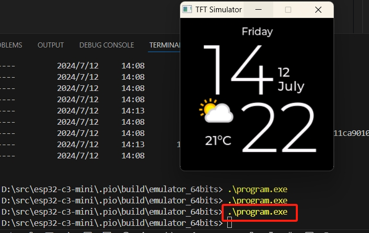

# 修改platformio配置
> -D SDL_INCLUDE_PATH="\"C:/Users/SDL2/include/SDL.h\"" ; Windows

# SDL 环境配置
[参考搭建](https://blog.csdn.net/mftang/article/details/139669200)

将SDL2.dll 拷贝
放到路径
> D:\src\esp32-c3-mini\.pio\build\emulator_64bits\program.exe

# 运行效果

通过鼠标拖动切换页面
